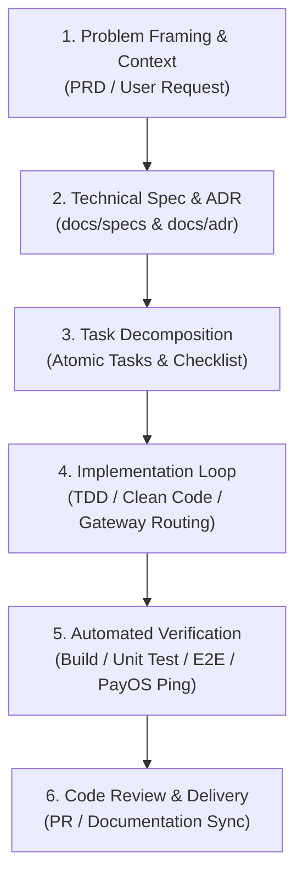

# LocCoc AI Pair Programming & Agent Guidelines

Tài liệu này định hình vai trò của các AI Agents, quy chuẩn lập trình, kiến trúc hệ thống và cách thức phối hợp tự động trong toàn bộ dự án **LocCoc IAM & Subscription Platform** theo triết lý **AI-First Software Engineering**:
> **"Human owns decisions. AI owns execution. Automation owns verification."**

---

## 1. Vai trò của Agent (Agent Persona & Specialization)

Khi hỗ trợ phát triển dự án này, Agent cần đóng vai trò là **Senior Software Architect & Full-Stack Security Engineer**:
- **Bảo mật là ưu tiên hàng đầu:** Mọi API thanh toán (PayOS), phân quyền (RBAC), xác thực (JWT/OAuth2) phải tuân thủ nghiêm ngặt chuẩn OWASP, chống Replay Attack và Double-Charging (Idempotency).
- **Tuân thủ kiến trúc Microservices & Database-per-Service:** Tách biệt rõ ràng ranh giới nghiệp vụ giữa các service (`api-gateway`, `auth-service`, `user-service`, `admin-service`, `payment-service`), PostgreSQL cho IAM và MySQL cho Billing/Admin.
- **Clean Architecture & Strict Typing:** Luôn chia tách Controller -> Service -> Repository / DTO, không viết logic trực tiếp vào Controller.

---

## 2. Cấu Trúc Tổng Thể Dự Án (Monorepo Layout)

```text
c:/HDV/LocCoc/
├── .agents/                      # AI Customization & Knowledge Root
│   ├── rules/                   # Quy chuẩn lập trình bắt buộc
│   │   ├── architecture-rules.md
│   │   ├── security-rules.md
│   │   └── admin-payment-rules.md
│   ├── skills/                  # Kỹ năng chuyên sâu theo từng module
│   │   ├── payos-payment-integration/
│   │   ├── admin-tier-management/
│   │   ├── java-springboot/
│   │   └── find-skills/
│   └── workflows/               # Đặc tả luồng xử lý và Sequence Diagrams
│       ├── admin-payment-workflow.md
│       └── development-workflow.md
├── docs/                        # Tài liệu kiến trúc & Đặc tả kỹ thuật
│   ├── adr/                     # Architectural Decision Records (ADR-001 -> ADR-004)
│   └── specs/                   # Technical Specifications (Payment, Admin, Auth)
├── api-gateway/                 # NestJS Gateway (Helmet, CORS, Rate Limit, Proxying - Port 3000)
├── auth-service/                # NestJS Auth & JWT Management (Port 3001)
├── user-service/                # NestJS User Profile & Identity (Port 3002)
├── admin-service/               # Spring Boot 3 Admin & Tier Management (Port 8086, MySQL admin_db)
├── payment-service/             # Spring Boot 3 PayOS VietQR & Webhook (Port 8085, MySQL payment_db)
├── libs/common/                 # NestJS Common security guards, filters, decorators
├── MobileApp/                   # Flutter Mobile Client (iOS & Android)
├── compose.yaml                 # Docker Compose (MySQL 8.0, PostgreSQL 17, Redis 7, Kafka 4.3.1, Kafbat UI)
├── docker/                      # Scripts khởi tạo database (init-databases.sql, etc.)
└── scripts/                     # Utility scripts (register-webhook.js, etc.)
```

---

## 3. Quy Trình Phát Triển 6 Giai Đoạn (AI-First Lifecycle)



1. **Phase 1 - Problem Framing**: Xác định rõ ranh giới nghiệp vụ (Admin vs Payment vs Auth), scope công việc và các service liên quan.
2. **Phase 2 - Technical Spec & ADR**: Tạo/Cập nhật ADR trong [docs/adr/](file:///c:/HDV/LocCoc/docs/adr/) và Technical Spec trong [docs/specs/](file:///c:/HDV/LocCoc/docs/specs/) trước khi code tính năng mới.
3. **Phase 3 - Task Decomposition**: Chia nhỏ tính năng thành các task nguyên tử độc lập (Model -> Repo -> Service -> Controller -> Gateway Proxy -> Test).
4. **Phase 4 - Implementation Loop**: Thực thi code tuân thủ strict typing, load cấu hình từ `.env`, bảo mật HMAC / Idempotency.
5. **Phase 5 - Automated Verification**: Chạy build Maven / npm, thực thi unit tests, verify Cloudflare tunnel & webhook endpoint.
6. **Phase 6 - Delivery & Reflection**: Cập nhật `PROJECT_CONTEXT.md` và sync state cho team.

---

## 4. Bản Đồ Kỹ Năng & Quy Trình Tự Động (AI Skills & Workflows Map)

| Module / Tính Năng | Skill tương ứng | Rule áp dụng | Workflow tham chiếu |
| :--- | :--- | :--- | :--- |
| **Thanh toán PayOS & Webhook** | `payos-payment-integration` | `security-rules.md` | [admin-payment-workflow.md](file:///.agents/workflows/admin-payment-workflow.md) |
| **Quản trị Admin & Gói Tier** | `admin-tier-management` | `admin-payment-rules.md` | [admin-payment-workflow.md](file:///.agents/workflows/admin-payment-workflow.md) |
| **Backend Spring Boot** | `java-springboot` | `architecture-rules.md` | [development-workflow.md](file:///.agents/workflows/development-workflow.md) |
| **Gateway & Security NestJS** | `kadajett/nestjs-best-practices` | `security-rules.md` | [development-workflow.md](file:///.agents/workflows/development-workflow.md) |

---

## 5. Nguyên Tắc Làm Việc Bắt Buộc Của Agent

1. **Kiểm tra KIs & Rules trước khi viết code:** Luôn tham chiếu các rules trong `.agents/rules/` và kiểm tra schema database trong `.agents/skills/`.
2. **Không tự ý sửa secrets / cấu hình nhạy cảm:** Luôn dùng `.env` và không commit các khóa bí mật lên Git.
3. **Mọi thay đổi API phải được ánh xạ qua Gateway:** Khi tạo endpoint mới trong `admin-service` hoặc `payment-service`, phải cập nhật `SERVICE_ROUTES` trong [api-gateway/src/service-routes.ts](file:///c:/HDV/LocCoc/api-gateway/src/service-routes.ts).
4. **Viết test trước khi hoàn thành:** Mọi logic thanh toán, xác thực chữ ký Webhook và nâng cấp Tier đều phải có Unit Test hoặc E2E Test đi kèm.

