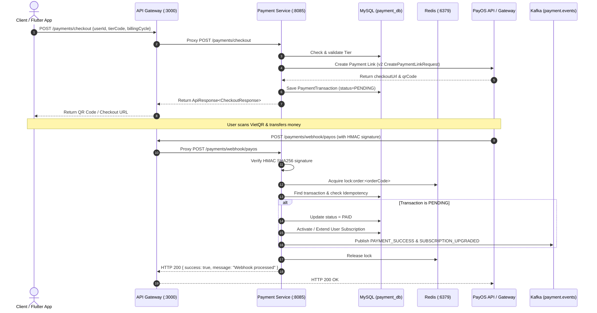

# Technical Specification: PayOS Checkout & Webhook Handling

## 1. Overview
Đặc tả kỹ thuật luồng khởi tạo thanh toán qua VietQR và xử lý Webhook từ PayOS trong module `payment-service` của hệ thống LocCoc.

## 2. Architecture & Data Flow



## 3. Endpoints

### 3.1. Khởi tạo thanh toán
- **URL**: `POST /payments/checkout`
- **Request Body**:
  ```json
  {
    "userId": "usr_test123",
    "tierCode": "PRO",
    "billingCycle": "MONTHLY",
    "returnUrl": "http://localhost:3000/payment-success",
    "cancelUrl": "http://localhost:3000/payment-cancel"
  }
  ```
- **Response**:
  ```json
  {
    "success": true,
    "statusCode": 200,
    "message": "Checkout initiated successfully",
    "data": {
      "orderCode": 1740000000000,
      "checkoutUrl": "https://pay.payos.vn/web/...",
      "qrCode": "vietqr://...",
      "amount": 99000,
      "status": "PENDING"
    }
  }
  ```

### 3.2. Webhook Callback
- **URL**: `POST /payments/webhook/payos`
- **Headers**: PayOS Standard Headers
- **Payload**: Standard PayOS Webhook Data (`code`, `desc`, `data: { orderCode, amount, reference, transactionDateTime, ... }`, `signature`).
- **Response**: Luôn trả về `HTTP 200 OK` (`{"success": true, "message": "Webhook processed"}`).

## 4. Security & Error Handling
- **Signature Verification**: Bắt buộc mọi webhook body đều phải được xác thực bằng `payOS.webhooks().verify(body)` sử dụng `PAYOS_CHECKSUM_KEY`.
- **Idempotency**: Dùng Redis Key `lock:order:{orderCode}` với TTL 10 giây để chống duplicate execution.
- **PayOS Verification Ping**: Khi đăng ký webhook, PayOS gửi 1 request test, controller nhận diện và trả về HTTP 200 ngay lập tức.
